# 💑 恋爱小本本 (Love Ledger)

> 一个专为情侣设计的"相爱相杀"记录工具。在这里，我们记录愤怒，也记录甜蜜；记录"罪行"，也记录原谅。

## 📖 项目来历

这是我和女友因为一些小事儿想到的项目。起因是这个可爱的姑娘考虑了很久送给我的礼物，结果发现我已经有了一个。这个项目就是由我"让我向你展示一下礼物怎么送好玩儿"产生的项目。目前我们一起提出想法，共同完成。

## ✨ 核心功能

这款 App 采用了**双视角设计**，根据用户选择的身份（男朋友/女朋友），界面主题和文案会有所不同，增加了互动的趣味性。

### 1. 身份认证与个性化设置
初次使用时，你需要选择你的身份并自定义称呼：
- **女朋友视角 (👿 记仇本本)**：粉色/红色主题，主打"记仇"，记录对方的每一次"惹祸"瞬间
- **男朋友视角 (🛡️ 生存记录)**：蓝色/冷色主题，主打"生存"，记录每一次"渡劫"经历
- **个性化称呼**：自定义对方叫你什么、你叫对方什么
- **自定义空间名称**：可以给记仇空间和回忆空间起个性化名字

<div align="center">
  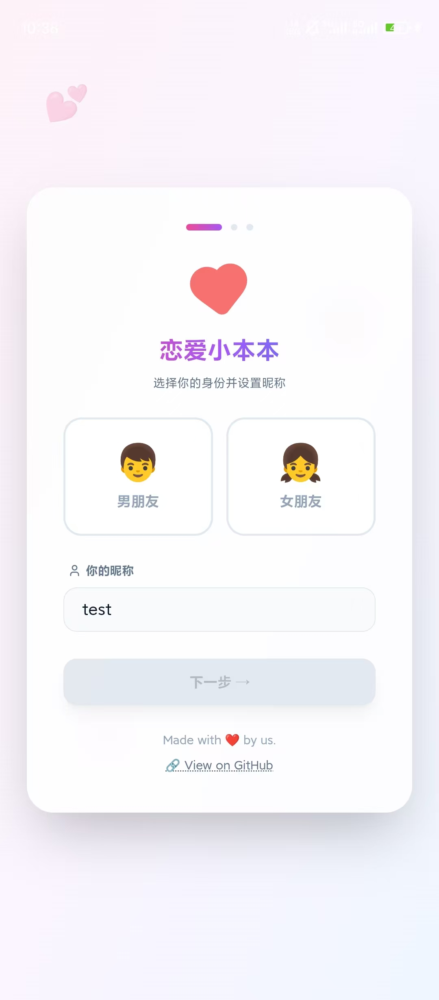
  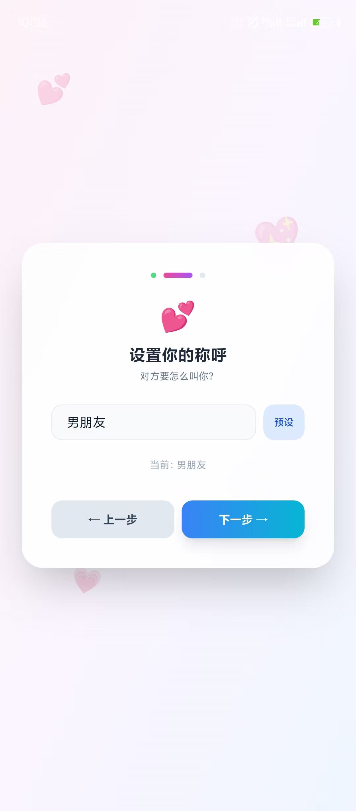
  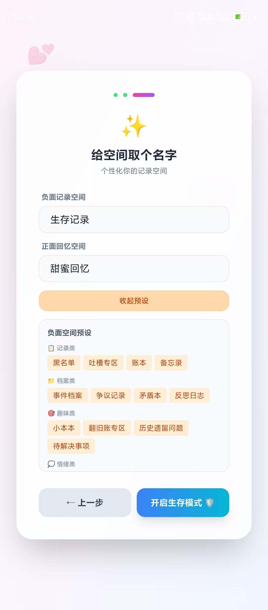
</div>
<p align="center"><i>三步完成个性化设置：选择身份 → 设置称呼 → 自定义空间名称</i></p>

### 2. 记仇本本 (负面记录)
记录生活中的小摩擦和不开心：
- **情绪类型选择**：6种情绪类型（愤怒😤、失望😔、委屈😢、无奈😑、嫌弃😒、无语🙄）
- **情绪强度**：通过滑块表达当时的情绪强度（1-100%）
- **详细记录**：记录罪名、详细经过、发生时间
- **照片证据**：支持上传照片作为"铁证"
- **标签分类**：快速添加预设标签（如：#偷吃、#迟到、#态度敷衍）
- **期望惩罚**：写下你希望对方做出的补偿（比如：一杯奶茶）
- **原谅机制**：当气消了可以点击"原谅"，将记录归档为历史
- **手势操作**：向右滑动快速原谅，向左滑动快速删除

<div align="center">
  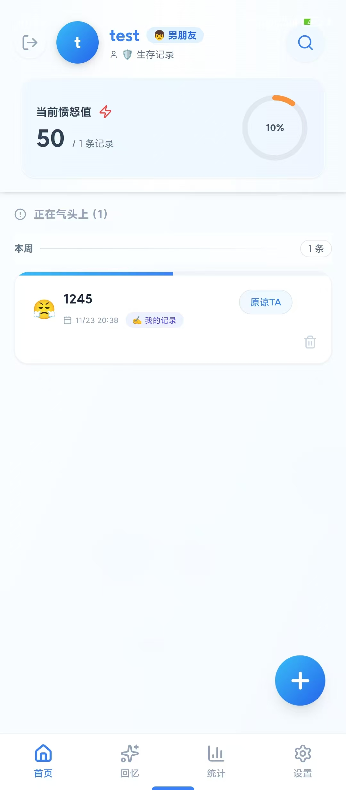
  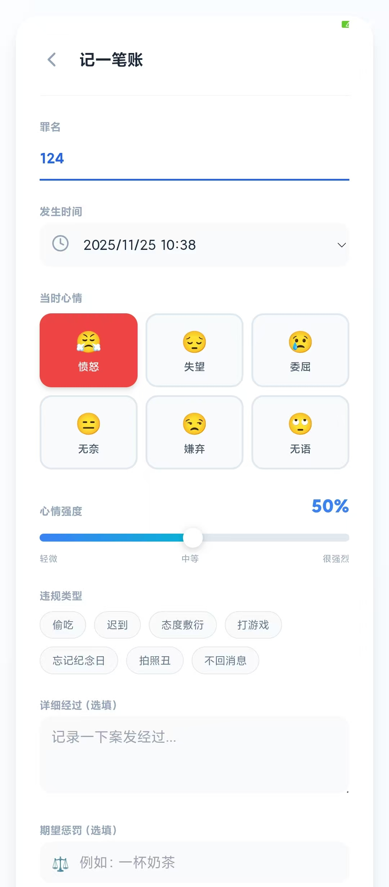
</div>
<p align="center"><i>左：记仇列表视图，右：添加/编辑记仇详情</i></p>

### 3. 甜蜜回忆录 (正面记录)
记录那些温暖感动的美好瞬间：
- **甜蜜度评分**：为这份回忆的甜蜜程度打分（1-100）
- **回忆详情**：记录标题、详细描述、当时的心情
- **照片回忆**：上传照片留住美好瞬间
- **类型标签**：惊喜、礼物、陪伴、道歉、浪漫、贴心、温暖
- **手势操作**：向左滑动快速删除

<div align="center">
  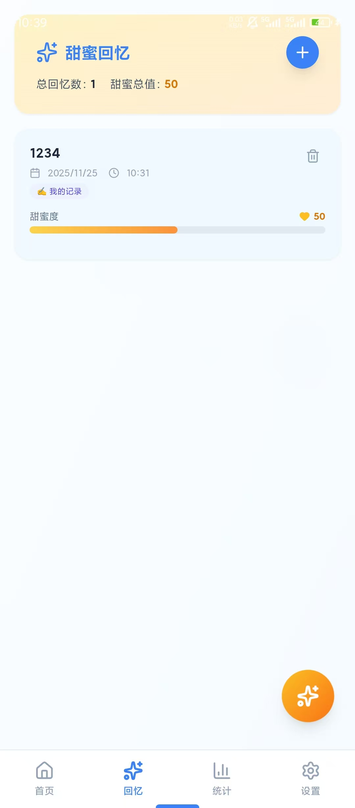
  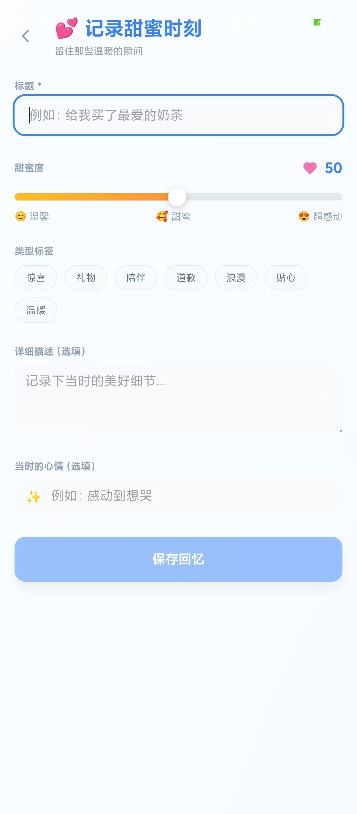
</div>
<p align="center"><i>左：甜蜜回忆列表，右：添加回忆详情</i></p>

### 4. 作者标识与私密模式
- **记录来源标识**：清晰显示每条记录是谁创建的（我的记录/TA的记录）
- **私密模式**：可以标记记录为私密，不会同步给对方
- **同步状态显示**：实时显示记录的同步状态（已同步/会被同步/不会被同步）

### 5. 成就系统 🏆
全新的成就系统，让记录变得更有趣：
- **30+ 成就徽章**：涵盖记仇、回忆、和谐三大类别
- **自动解锁**：达成条件后自动解锁并弹出通知
- **进度追踪**：实时显示每个成就的完成进度
- **成就墙展示**：在统计页面查看所有成就的解锁情况

**成就类别**：
- **记仇类**：第一笔账、记仇达人、账本专家、火山爆发、脾气暴躁、铁证如山等
- **回忆类**：第一份甜蜜、甜蜜回忆、幸福满溢、超级感动、天天甜蜜、美好瞬间等
- **和谐类**：第一次原谅、宽容大度、和平使者、天使伴侣、完美关系、神仙眷侣等
- **综合类**：完美平衡、百里挑一、天长地久、忠实用户、连续记录等

### 6. 关系和谐度统计
App 会根据你们的记录自动生成数据分析：
- **和谐度评分**：综合计算愤怒值、甜蜜度和原谅率，得出 0-100 的关系和谐度分数
- **数据卡片**：总记录数、原谅率、平均愤怒值、平均甜蜜度等关键指标
- **标签云**：可视化展示最常用的标签
- **趋势图表**：使用 Recharts 展示数据趋势
- **洞察建议**：根据数据给出趣味性的评价和建议
- **成就墙**：查看所有已解锁和待解锁的成就

<div align="center">
  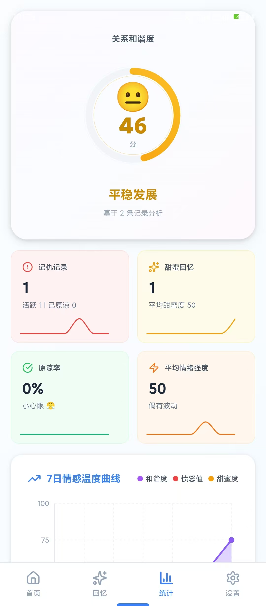
  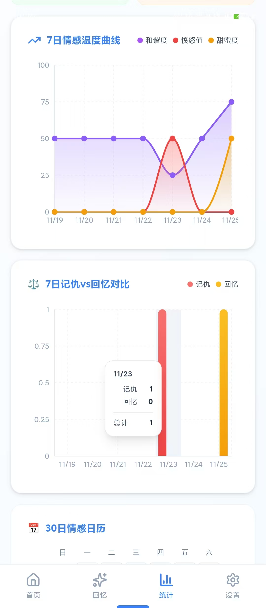
  
</div>
<p align="center"><i>数据统计三联：和谐度评分 → 趋势图表 → 标签云与成就墙</i></p>

### 7. 照片功能
基于 IndexedDB 的照片管理系统：
- **拍照或选择**：支持从相机拍照或从相册选择
- **自动压缩**：原图压缩至最大1920px宽度，质量80%
- **缩略图**：自动生成200px缩略图用于列表显示
- **网格展示**：以3列网格形式展示照片
- **全屏查看**：点击照片可全屏查看，支持左右滑动切换
- **存储优化**：照片独立存储在IndexedDB中，不占用localStorage空间

### 8. 搜索与筛选
强大的搜索和筛选功能：
- **关键词搜索**：搜索标题和描述内容
- **类型筛选**：分别查看记仇或回忆
- **作者筛选**：筛选我的记录或对方的记录（配对后）
- **高亮显示**：搜索结果关键词高亮
- **日期分组**：自动按今天、昨天、本周、更早分组显示

### 9. 设置与数据管理
完善的个人设置和数据管理功能：
- **个人信息编辑**：修改昵称、切换角色身份
- **数据导出**：导出所有数据为JSON格式备份文件
- **数据导入**：从备份文件恢复数据
- **数据清空**：清空所有记录（双重确认保护）
- **存储统计**：实时显示存储使用情况
- **应用信息**：版本号、隐私说明等

<div align="center">
  
  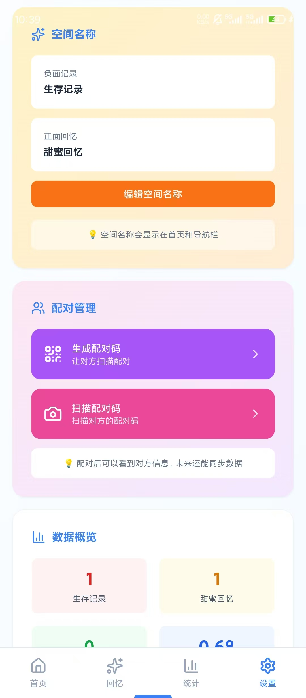
  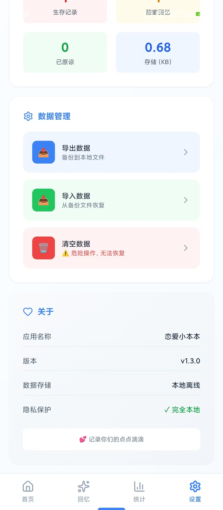
</div>
<p align="center"><i>设置页面：个人信息 → 配对功能 → 数据管理</i></p>

### 10. 二维码配对功能（预留）
为未来的双人同步功能预留接口：
- **配对邀请**：生成二维码邀请对方配对
- **扫码配对**：扫描对方的二维码完成配对
- **数据同步**：配对后自动同步非私密记录
- **关系管理**：记录纪念日、双方生日等信息

## 🛠️ 技术栈

本项目使用以下技术构建：
- **核心框架**: React 19
- **TypeScript**: 类型安全的开发体验
- **构建工具**: Vite 6
- **移动端适配**: Capacitor 7 (支持打包为 Android/iOS App)
- **UI 框架**: Tailwind CSS
- **动画库**: Framer Motion 12
- **图标库**: Lucide React
- **图表库**: Recharts 3
- **数据存储**: 
  - LocalStorage (用户配置、文本数据)
  - IndexedDB (照片存储)
- **相机功能**: @capacitor/camera
- **二维码扫描**: @capacitor-mlkit/barcode-scanning
- **文件系统**: @capacitor/filesystem
- **二维码生成**: qrcode.react
- **数据压缩**: lz-string
- **AI集成**: Google Generative AI (Gemini)

## 📱 应用信息

- **应用名称**: 恋爱小本本
- **App ID**: com.lovenote.app
- **当前版本**: v1.3.0
- **最低Android版本**: Android 5.0 (API Level 21)

## 🚀 快速开始

### 开发环境要求
- Node.js 18+ 
- npm 或 yarn
- Android Studio (如需打包Android应用)
- Xcode (如需打包iOS应用)

### 安装步骤

1. **克隆项目**
   ```bash
   git clone https://github.com/luyu14039/lovers-notebook.git
   cd lovers-notebook
   ```

2. **安装依赖**
   ```bash
   npm install
   ```

3. **启动开发服务器**
   ```bash
   npm run dev
   ```
   访问 http://localhost:3000

### 构建移动应用

#### Android 应用

1. **同步 Capacitor**
   ```bash
   npm run cap:sync
   ```

2. **打开 Android Studio**
   ```bash
   npm run cap:android
   ```

3. **在 Android Studio 中构建并运行**
   - 连接Android设备或启动模拟器
   - 点击 Run 按钮

#### 构建生产版本

```bash
# 构建 Web 版本
npm run build

# 同步到 Android
npm run cap:build

# 在 Android Studio 中生成 APK
Build > Build Bundle(s) / APK(s) > Build APK(s)
```

### 环境变量配置（可选）

创建 `.env` 文件用于 AI 功能：
```env
GEMINI_API_KEY=your_api_key_here
```

## 📦 项目结构

```
sis-app/
├── android/                 # Android 原生项目
├── components/             # React 组件
│   └── SkeletonLoader.tsx  # 骨架屏组件
├── md_pics/               # README 图片资源
├── animations.ts          # 动画配置
├── index.tsx              # 应用主入口（7000+ 行）
├── theme.config.ts        # 主题配置
├── phase2.config.ts       # 第二阶段功能配置
├── capacitor.config.ts    # Capacitor 配置
├── vite.config.ts         # Vite 构建配置
├── tsconfig.json          # TypeScript 配置
├── package.json           # 依赖配置
├── CHANGELOG.md           # 更新日志
├── FEATURES_UPDATE.md     # 功能更新说明
└── README.md              # 项目说明
```

## 🎨 UI/UX 特色

- **流畅动画**: 基于 Framer Motion 的丝滑交互动画
- **手势操作**: 卡片滑动操作，提升操作效率
- **响应式设计**: 自适应不同屏幕尺寸
- **主题区分**: 男女双视角不同的主题色
- **玻璃态效果**: 现代化的毛玻璃 UI 设计
- **骨架屏**: 加载时的友好过渡效果
- **无障碍支持**: 支持减少动画偏好设置

## 📊 性能优化

- **防抖保存**: 数据变更后300ms防抖写入，减少90%+写入操作
- **代码分割**: React.lazy 懒加载组件
- **Memo优化**: React.memo 减少不必要的重渲染
- **useMemo/useCallback**: 避免重复计算和函数创建
- **IndexedDB**: 照片独立存储，不影响主数据读写
- **图片压缩**: 自动压缩照片至合理大小
- **虚拟列表**: 长列表优化（待实现）

## 🔒 隐私与安全

本项目**无任何联网需求**（除非启用AI功能）：
- ✅ 所有数据保存在设备本地
- ✅ 照片存储在 IndexedDB 中
- ✅ 不上传任何用户数据到服务器
- ✅ 私密模式保护敏感记录
- ✅ 支持数据导出备份
- ⚠️ 更换设备需要手动导入数据

## 🚧 开发计划

### v1.4.0 (规划中)
- [ ] 深色模式支持
- [ ] 自定义主题色
- [ ] 更多成就徽章
- [ ] 数据云端备份
- [ ] 设备间数据同步
- [ ] 图表数据导出

### v2.0.0 (远期规划)
- [ ] 完整的配对功能
- [ ] 实时消息通知
- [ ] 照片云端存储
- [ ] 更丰富的图表分析
- [ ] AI 智能建议（基于 Gemini）
- [ ] 小组件支持

详见 [FEATURES_UPDATE.md](FEATURES_UPDATE.md) 和 [CHANGELOG.md](CHANGELOG.md)

## 📥 下载与安装

本项目已打包好 APK 文件，您可以直接从 [Releases](https://github.com/luyu14039/lovers-notebook/releases) 页面下载最新版本进行安装体验。

## 🐛 已知问题

1. **Framer Motion类型警告**: 编译时有类型警告，不影响运行
2. **Web端相机限制**: 浏览器中可能无法调用原生相机，需要在移动端测试
3. **照片同步**: 当前版本照片仅保存在本地，不会同步

## 🤝 贡献指南

欢迎提交 Issue 和 Pull Request！

### 开发规范
- 使用 TypeScript 编写代码
- 遵循现有的代码风格
- 提交前确保代码通过类型检查
- 添加必要的注释和文档

### 提交 Bug
请包含以下信息：
- 设备型号和系统版本
- 复现步骤
- 预期行为和实际行为
- 截图（如有必要）

## 📄 版权与许可

1. **开源无偿**: 本项目为开源无偿项目，旨在分享与学习
2. **使用许可**: 您可以自由 Fork 本项目用于自用、学习或其他**非盈利**目的
3. **商业限制**: 任何形式的商业使用（包括但不限于上架应用商店收费、内置广告盈利等）均须事先征求作者意见

## 🙏 致谢

感谢所有开源项目和社区的支持：
- React 团队
- Vite 团队
- Capacitor 团队
- Framer Motion
- 所有依赖库的维护者们

## 📞 反馈与联系

如果在使用过程中遇到任何问题，或者有好的建议：
- 提交 [Issue](https://github.com/luyu14039/lovers-notebook/issues)
- 查看 [Discussions](https://github.com/luyu14039/lovers-notebook/discussions)
- 关注项目获取最新动态

---

*Made with ❤️ by us. 让每一份记录都见证你们的成长。*

## ⭐ Star History

如果这个项目对你有帮助，欢迎给个 Star ⭐！
