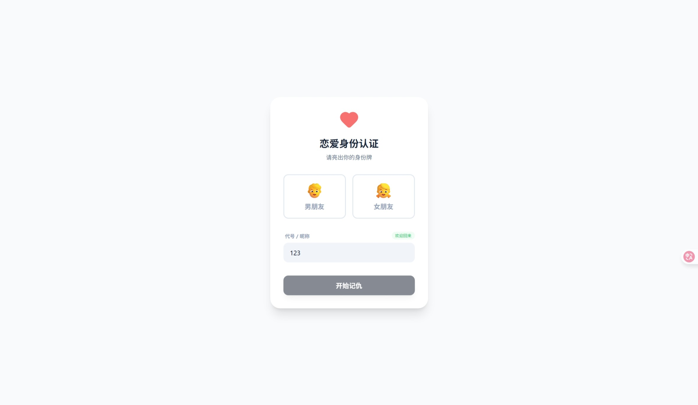
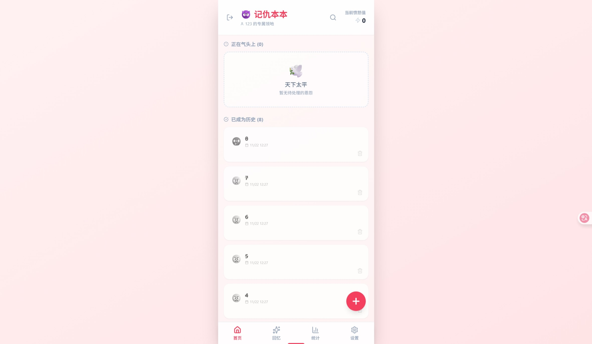
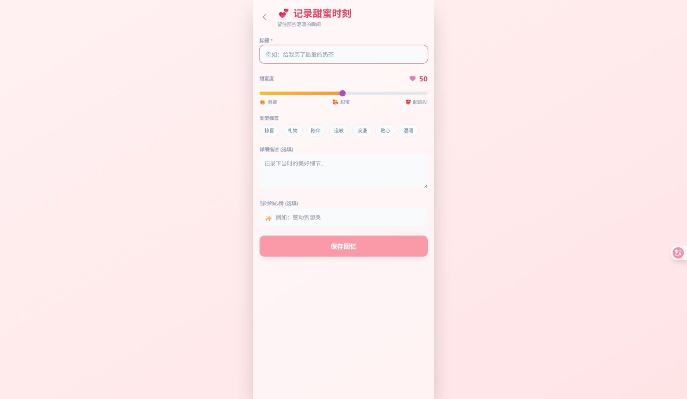
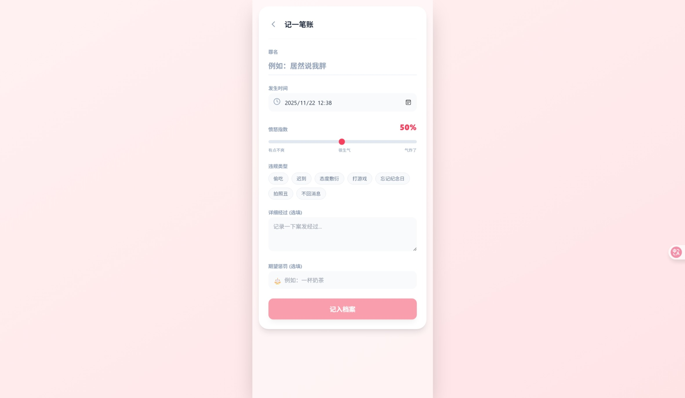
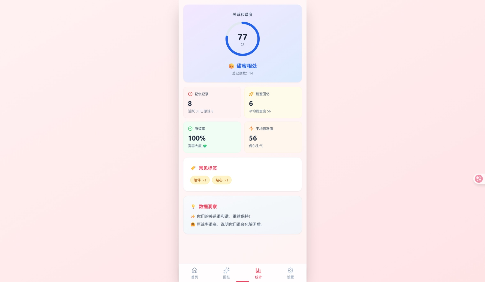

# 💑 Love Ledger (情侣记仇本)

> 一个专为情侣设计的“相爱相杀”记录工具。在这里，我们记录愤怒，也记录甜蜜；记录“罪行”，也记录原谅。



## 📖 项目来历

这是我和女友因为一些小事儿想到的项目。起因是这个可爱的姑娘考虑了很久送给我的礼物，结果发现我已经有了一个。这个项目就是由我“让我向你展示一下礼物怎么送好玩儿”产生的项目。目前我们一起提出想法，共同完成。

## ✨ 功能详细说明

这款 App 采用了**双视角设计**，根据用户选择的身份（男朋友/女朋友），界面主题和文案会有所不同，增加了互动的趣味性。

### 1. 身份认证与专属界面
初次使用时，你需要选择你的身份。
- **女朋友视角 (👿 记仇本本)**：粉色/红色主题，主打“记仇”，记录对方的每一次“惹祸”瞬间。
- **男朋友视角 (🛡️ 生存记录)**：蓝色/冷色主题，主打“生存”，记录每一次“渡劫”经历。

### 2. 记仇本本 (Grudge Ledger)
这里是记录“恩怨”的地方。
- **记录罪行**：详细记录对方的“罪名”、详细经过、发生时间。
- **愤怒指数**：通过滑块直观地表达你当时的愤怒程度 (1-100%)。
- **期望惩罚**：写下你希望对方做出的补偿（比如：一杯奶茶）。
- **原谅机制**：当气消了，或者对方道歉了，可以点击“原谅”，将记录归档为历史，见证你们的包容。



### 3. 甜蜜回忆录 (Sweet Memories)
生活不只有摩擦，更多的是甜蜜。
- **记录美好**：记录下那些感动的、温馨的瞬间。
- **甜蜜度打分**：为这份回忆的甜蜜程度打分。
- **心情标签**：记录当时的心情和感受。



### 4. 记录详情与编辑
无论是记仇还是回忆，都提供了详细的表单进行记录。支持添加标签（如：#偷吃、#迟到、#惊喜、#浪漫），方便后续回顾。



### 5. 关系和谐度统计 (Statistics)
App 会根据你们的记录自动生成数据分析。
- **和谐度评分**：综合计算愤怒值、甜蜜度和原谅率，得出一个 0-100 的关系和谐度分数。
- **数据洞察**：统计记仇总数、原谅率、平均愤怒值等，并给出趣味性的评价（如“宽容大度”或“小心眼”）。



## 🛠️ 技术栈

本项目使用以下技术构建：
- **核心框架**: React 19
- **构建工具**: Vite
- **移动端适配**: Capacitor (支持打包为 Android App)
- **UI 样式**: Tailwind CSS
- **图标库**: Lucide React
- **数据存储**: LocalStorage (本地持久化)

## 🚀 快速开始

如果你也想运行这个项目：

1.  **安装依赖**
    ```bash
    npm install
    ```

2.  **启动开发服务器**
    ```bash
    npm run dev
    ```

3.  **构建 Android 应用** (需要配置 Android 开发环境)
    
    ```bash
    npm run cap:android
    ```

---

## 📦 下载与安装

本项目已打包好 APK 文件，您可以直接从 [Releases](../../releases) 页面下载最新版本进行安装体验。

## 🔒 隐私与安全

本项目目前**无任何联网需求**。所有的记录、图片和统计数据均保存在您的手机本地存储中，不会上传到任何服务器，请放心使用。

## 📄 版权与许可

1.  **开源无偿**：本项目为开源无偿项目，旨在分享与学习。
2.  **使用许可**：您可以自由 Fork 本项目用于自用、学习或其他**非盈利**目的。
3.  **商业限制**：任何形式的商业使用（包括但不限于上架应用商店收费、内置广告盈利等）均须事先征求作者意见。

## 🤝 反馈与贡献

如果在使用过程中遇到任何问题，或者有好的建议，欢迎 Fork 本项目或在 [Issues](../../issues) 中提出。让我们一起完善这个有趣的礼物！

---
*Made with ❤️ by us.*
